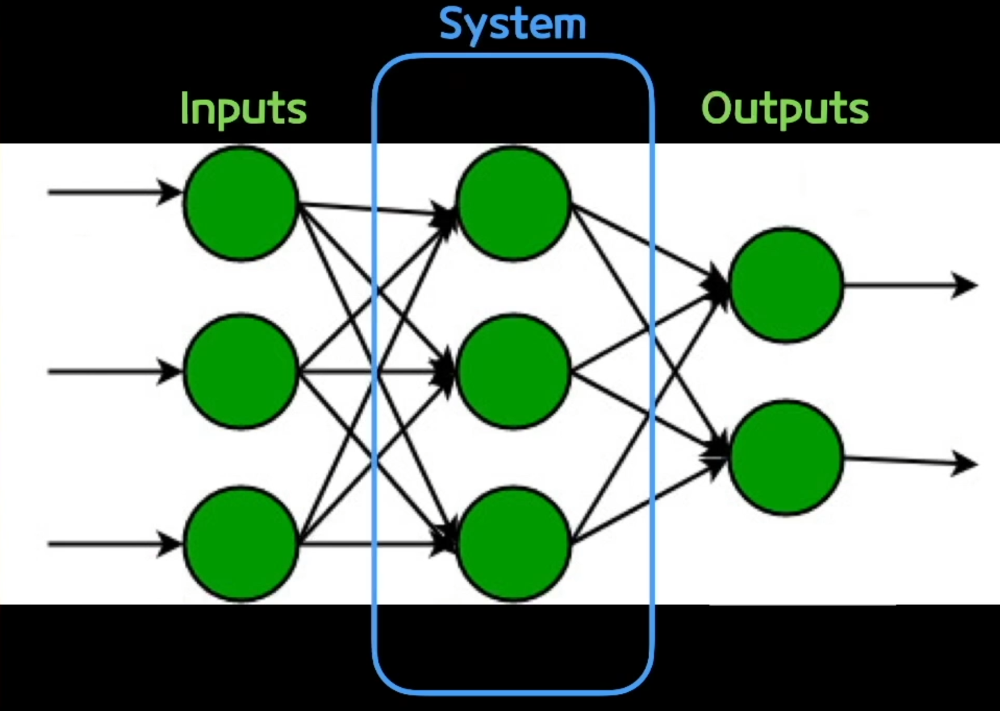
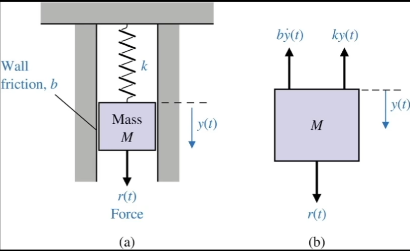

state란 무엇인가? 

시스템에 대한 미분 방정식을 푸는데 있어서 과정을 나누어서 풀기 위해 등장된 개념 

시스템을ㄹ 수식화할때 state를 정의해서 그것을 중심으로 풀자 

state는 인풋 또는 state끼리 영향을 받는 output은 인풋과 state에 의해서 결정됨. 

state를 통해서 미분방정식을 행렬방정식으로 풀수있도록 state variable 도입

요약하자면 state vaiable 모델이라는건 문제를 푸는 과정 자체에 의미부여를 하기 위한 목적과 컴퓨터 연산을 수행하기 위한 목적 






```python

```
